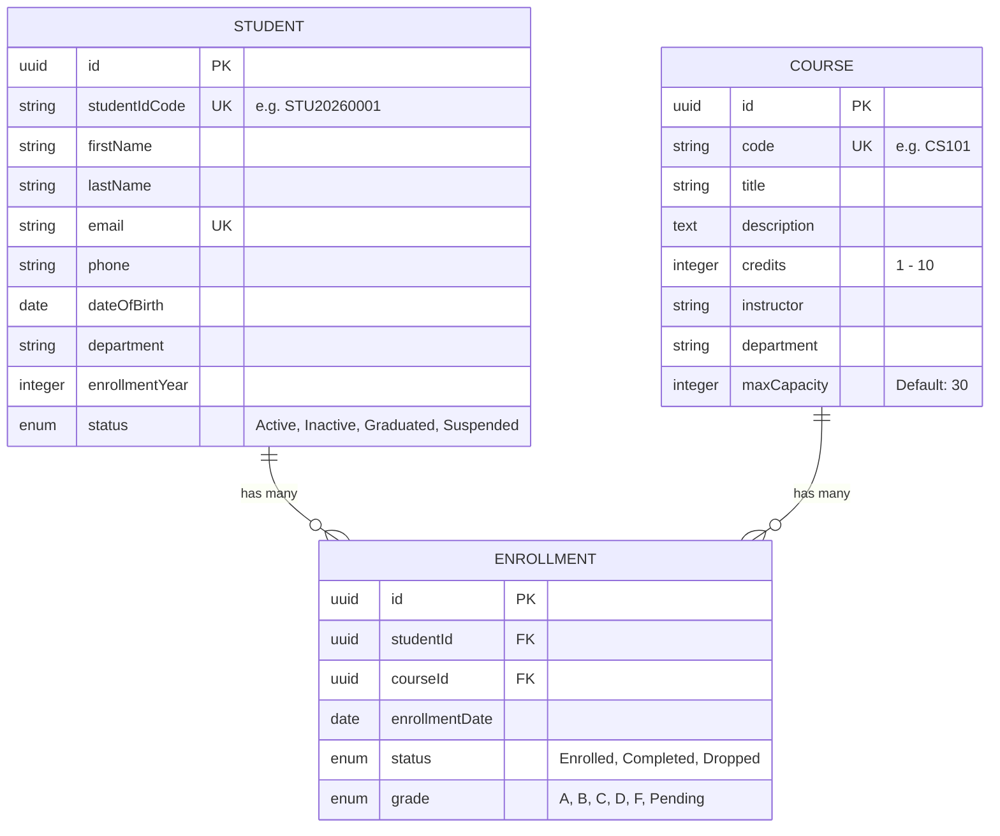

# Student Record Management API

A production-ready RESTful backend API built with **Express.js**, **Node.js**, **SQLite**, and **Sequelize ORM** for managing student records, course catalogs, and academic enrollments.

---

## 🌟 Key Features

1. **Relational Database Design**: Models for `Student`, `Course`, and `Enrollment` with full foreign key constraints, cascade rules, and indexes.
2. **RESTful API Endpoints**: Full CRUD operations for Students, Courses, and Enrollments.
3. **Data Validation**: Comprehensive incoming payload validation using `express-validator` middleware (e.g., email format, credit boundaries, date checks, unique constraints).
4. **Search, Filtering, Sorting & Pagination**:
   - Multi-field text search (names, email, course code, instructor).
   - Attribute filtering (department, status, grade, enrollment year).
   - Dynamic sorting (`sortBy` and `order`).
   - Page-based pagination (`page`, `limit`, returning `totalItems`, `totalPages`, `hasNextPage`, `hasPrevPage`).
5. **Business Logic Guards**:
   - Prevents duplicate active student enrollments.
   - Enforces course maximum capacity limits.
   - Validates active student status before allowing enrollment.
   - Prevents deletion of courses with active enrollments.
6. **Centralized Error Handling**: Standardized HTTP status codes (200, 201, 400, 404, 409, 500) and consistent JSON responses.
7. **Interactive Dashboard UI**: Built-in web dashboard served at `http://localhost:5000` to visually manage records and test API endpoints in real-time.

---

## 🏗️ Relational Database Models & Schema



---

## 🚀 Quick Start Guide

### 1. Installation
Clone or navigate to the project directory and install dependencies:
```bash
npm install
```

### 2. Database Seeding
Populate the database with initial sample students, courses, and enrollments:
```bash
npm run seed
```

### 3. Running the Server
Start the server in production or development mode:
```bash
# Production mode
npm start

# Development mode with live reload
npm run dev
```

Open your browser and navigate to **`http://localhost:5000`** to access the interactive API management dashboard!

---

## 📡 API Endpoint Reference

### 👨‍🎓 Students API (`/api/students`)

| Method | Endpoint | Description | Query Parameters / Body |
| :--- | :--- | :--- | :--- |
| `GET` | `/api/students` | Get all students | `page`, `limit`, `search`, `department`, `status`, `sortBy`, `order` |
| `GET` | `/api/students/:id` | Get student details & enrolled courses | `:id` (UUID) |
| `POST` | `/api/students` | Create a new student record | `{ firstName, lastName, email, dateOfBirth, department, enrollmentYear, phone?, status?, studentIdCode? }` |
| `PUT` | `/api/students/:id` | Update student record | `{ firstName?, lastName?, email?, department?, status?, ... }` |
| `DELETE` | `/api/students/:id` | Delete student and cascade enrollments | `:id` (UUID) |

---

### 📚 Courses API (`/api/courses`)

| Method | Endpoint | Description | Query Parameters / Body |
| :--- | :--- | :--- | :--- |
| `GET` | `/api/courses` | Get all courses | `page`, `limit`, `search`, `department`, `credits`, `sortBy`, `order` |
| `GET` | `/api/courses/:id` | Get course details & enrolled students | `:id` (UUID) |
| `POST` | `/api/courses` | Create a new course offering | `{ code, title, credits, instructor, department, description?, maxCapacity? }` |
| `PUT` | `/api/courses/:id` | Update course details | `{ code?, title?, credits?, instructor?, department?, maxCapacity? }` |
| `DELETE` | `/api/courses/:id` | Delete course record | `:id` (UUID) |

---

### 📝 Enrollments API (`/api/enrollments`)

| Method | Endpoint | Description | Query Parameters / Body |
| :--- | :--- | :--- | :--- |
| `GET` | `/api/enrollments` | Get all enrollments | `page`, `limit`, `search`, `studentId`, `courseId`, `status`, `grade` |
| `GET` | `/api/enrollments/:id` | Get single enrollment detail | `:id` (UUID) |
| `POST` | `/api/enrollments` | Enroll student in a course | `{ studentId, courseId, status?, grade? }` |
| `PATCH` | `/api/enrollments/:id` | Update status or assigned grade | `{ status?, grade? }` |
| `DELETE` | `/api/enrollments/:id` | Drop or remove enrollment | `:id` (UUID) |

---

## 🧪 Sample Request Payload & Response Format

### Standard Paginated Response Format (`GET /api/students?page=1&limit=2`)
```json
{
  "success": true,
  "message": "Students fetched successfully",
  "data": [
    {
      "id": "550e8400-e29b-41d4-a716-446655440000",
      "studentIdCode": "STU20260001",
      "firstName": "Alice",
      "lastName": "Johnson",
      "email": "alice.johnson@university.edu",
      "department": "Computer Science",
      "enrollmentYear": 2024,
      "status": "Active"
    }
  ],
  "pagination": {
    "totalItems": 5,
    "totalPages": 3,
    "currentPage": 1,
    "itemsPerPage": 2,
    "hasNextPage": true,
    "hasPrevPage": false
  }
}
```

### Validation Error Response (`400 Bad Request`)
```json
{
  "success": false,
  "message": "Validation Failed",
  "errors": [
    {
      "field": "email",
      "message": "Must be a valid email address",
      "value": "invalid-email-format"
    }
  ]
}
```

---

## 📁 Project Directory Structure

```
task1/
├── public/                # Interactive Web Dashboard (HTML/CSS/JS)
│   ├── index.html
│   ├── styles.css
│   └── app.js
├── src/
│   ├── config/            # SQLite & Sequelize DB connection
│   │   └── database.js
│   ├── controllers/       # Business logic controllers
│   │   ├── studentController.js
│   │   ├── courseController.js
│   │   └── enrollmentController.js
│   ├── middleware/        # Express validators & Error handling
│   │   ├── validate.js
│   │   ├── errorHandler.js
│   │   └── validators/
│   │       ├── studentValidator.js
│   │       ├── courseValidator.js
│   │       └── enrollmentValidator.js
│   ├── models/            # Relational Sequelize models
│   │   ├── index.js
│   │   ├── Student.js
│   │   ├── Course.js
│   │   └── Enrollment.js
│   ├── routes/            # REST API Routes
│   │   ├── index.js
│   │   ├── studentRoutes.js
│   │   ├── courseRoutes.js
│   │   └── enrollmentRoutes.js
│   ├── scripts/           # Database seeder script
│   │   └── seed.js
│   └── utils/             # Response formatters & Pagination helpers
│       ├── apiResponse.js
│       └── pagination.js
├── app.js                 # Express application configuration
├── server.js              # Server entry point
├── package.json
└── README.md
```

---

## 🛡️ License
Distributed under the ISC License.
